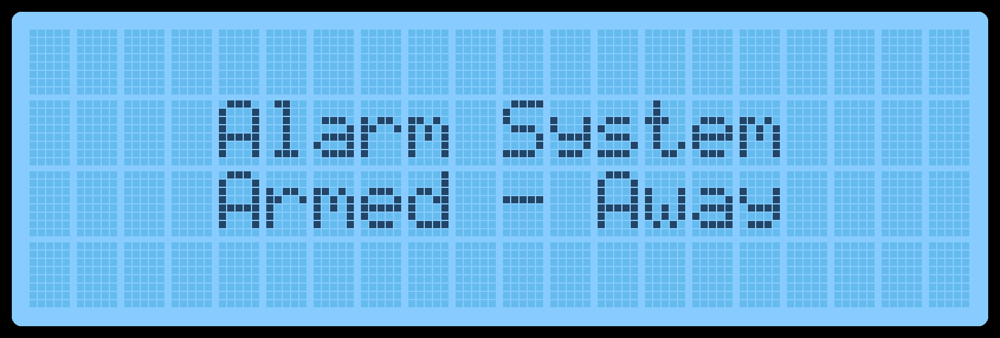
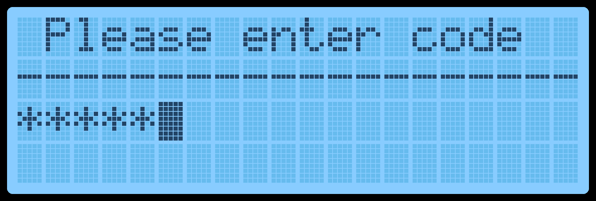
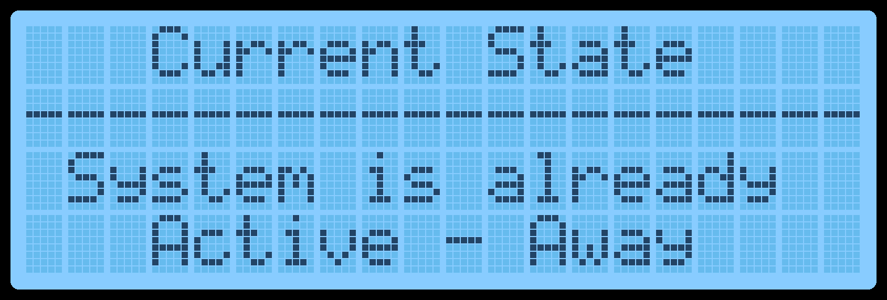
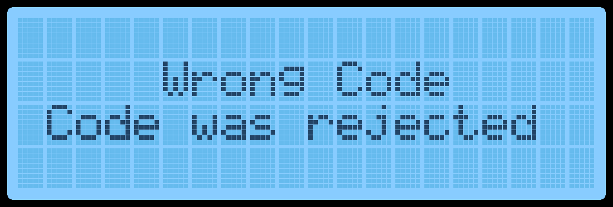
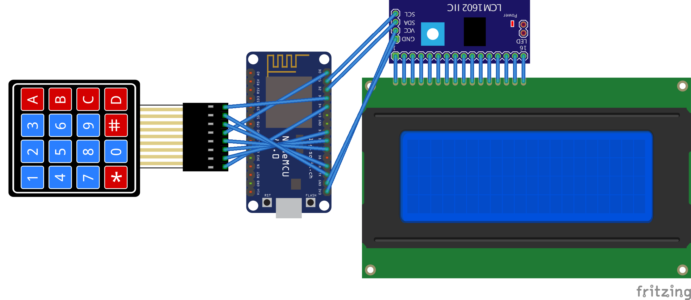
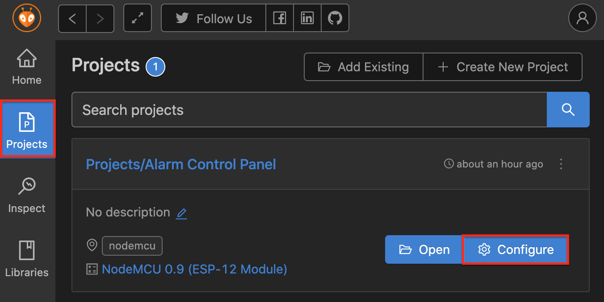
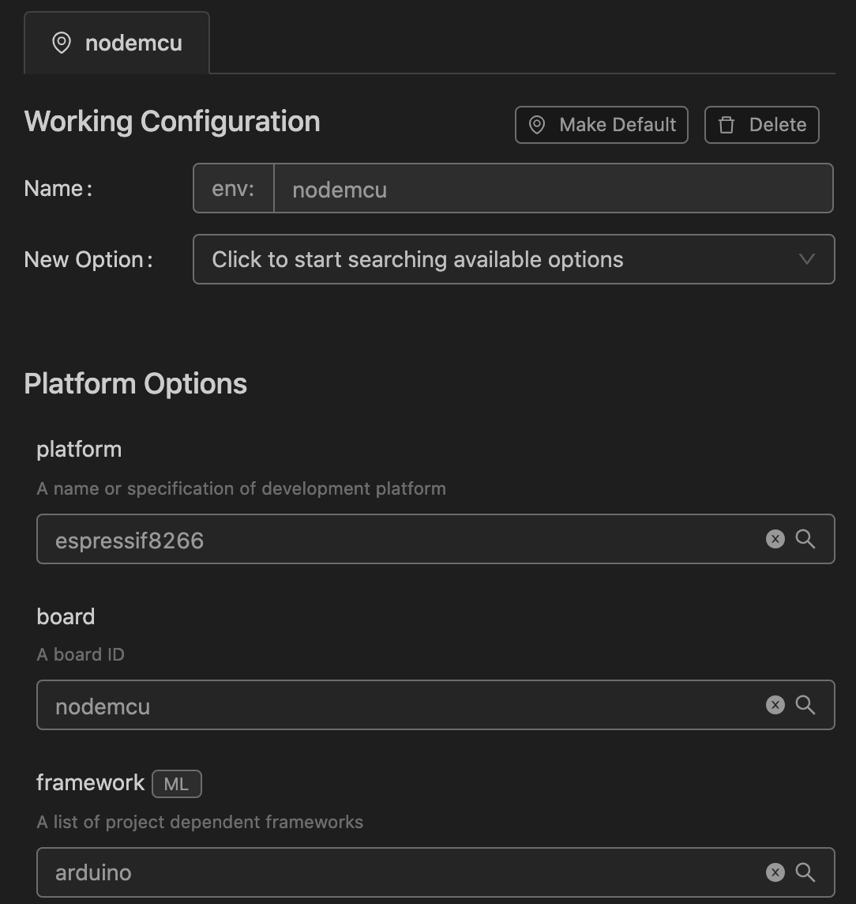

# HASS-YAAP
##### Yet another alarm (control) panel for Home Assistant.
* Change alarm system mode (away, home, night, disarmed)
* Welcome people arriving by their name
* Turn off all lights (when you leave for example)

### Usage

##### Arming & Disarming

1. Press `*` to enter code mode
2. Enter Pin
3. Finish sequence by using
   * `A`: Arm Away
   * `B`: Arm Night
   * `C`: Arm Home
   * `D`: Disarm
4. You can also reset the entered code by pressing `*` again

##### Turn of lights

Press `#` while on the main state screen. On any other screen `#` will go back to the main screen.

##### Enable LCD backlight

Press any key.

### Example Screens











## Used Hardware

#### Parts

* [4x4 Matrix Keypad Keyboard](https://www.az-delivery.de/en/products/4x4-matrix-numpad) 

* [4x20 characters LCD with I2C interface](https://www.az-delivery.de/en/products/hd44780-2004-lcd-display-bundle-4x20-zeichen-mit-i2c-schnittstelle)

* [ESP8266 Board](https://www.az-delivery.de/en/products/nodemcu-lua-amica-v2-modul-mit-esp8266-12e-unverloetet) (You will proably need to change the config in PlatformIO for your board)

  

You should probably choose a better pin layout than I did but apparently this is what I used judging from the code 😅


## ESP8266 Configuration

Download and install the [PlatformIO IDE](https://platformio.org).

Create a file called `config.h` in the folder `include` with the contents of [config_example.h](https://github.com/paviro/HASS-YAAP/blob/main/include/config_example.h).


Choose a language file (default selected is English):

```c++
#include "translations/EN.h"
```

Add your WiFi and MQTT credentials:

```c++
#define WiFi_SSID              "WiFi_SSID"
#define WiFi_PW                "WiFi_PW"
#define MQTT_SERVER_IP         "192.168.x.y"
#define MQTT_USER              "MQTT_USER"
#define MQTT_PW                "MQTT_PW"
#define MQTT_CLIENT_NAME       "AlarmControlPanel"
```

**Adjust the other settings to your liking.**


If needed adjust the settings in PlatformIO for your board.






## Home Assistant Configuration

### Requirements

* MQTT Server (for Home Assistant OS: [Mosquitto](https://github.com/home-assistant/addons/tree/master/mosquitto))

* An alarm system (for example: [Manual](https://www.home-assistant.io/integrations/manual/))

* Some Automations (see YAML below)

  

### MQTT

Setup a MQTT server, configure it in Home Assistant and add an account for the alarm panel on the server.


### Automations

#### Required automations

##### MQTT Alarm Panel - Alarm State

Sends alarm system changes to the panel & receives state requests from the panel.

Replace ```alarm_control_panel.alarmsystem```  with the entity id of your alarm system.

```yaml
- alias: "MQTT Alarm Panel - Alarm State"
  trigger:
    - platform: mqtt
      topic: "alarmpanel/get"
      payload: "state"
    - platform: state
      entity_id: alarm_control_panel.alarmsystem
  action:
    - service: mqtt.publish
      data:
        topic: "alarmpanel/state"
        payload: "{{ states('alarm_control_panel.alarmsystem') }}"
```

##### MQTT Alarm Panel - Alarm State

Automation to change the state of the alarm system. You can define valid codes in the ```variables``` section. 

The name of the code will be used to send a message to a specified phone when the alarm is disabled via the panel. You can disable this by removing the ```notify``` action.

Replace ```alarm_control_panel.alarmsystem```  with the entity id of your alarm system.

Replace ```notify.enter_phone_id_here```  with the entity id of your phone.

```yaml
- alias: "MQTT Alarm Panel - Set Alarm State"
  variables:
    codes:
      23342: "Code 1"
      6563434: "Code 2"
      9189938992: "Code 3"
  trigger:
    - platform: mqtt
      topic: "alarmpanel/arm/away"
    - platform: mqtt
      topic: "alarmpanel/arm/home"
    - platform: mqtt
      topic: "alarmpanel/arm/night"
    - platform: mqtt
      topic: "alarmpanel/disarm"
  action:
    - choose:
        - conditions:
            - condition: template
              value_template: '{{ trigger.payload | int in codes }}'
          sequence:
            - choose:
                - conditions:
                    - condition: template
                      value_template: "{{ trigger.topic == 'alarmpanel/arm/away' }}"
                  sequence:
                    - service: alarm_control_panel.alarm_arm_away
                      entity_id: alarm_control_panel.alarmsystem
                - conditions:
                    - condition: template
                      value_template: "{{ trigger.topic == 'alarmpanel/arm/home' }}"
                  sequence:
                    - service: alarm_control_panel.alarm_arm_home
                      entity_id: alarm_control_panel.alarmsystem
                - conditions:
                    - condition: template
                      value_template: "{{ trigger.topic == 'alarmpanel/arm/night' }}"
                  sequence:
                    - service: alarm_control_panel.alarm_arm_night
                      entity_id: alarm_control_panel.alarmsystem
                - conditions:
                    - condition: template
                      value_template: "{{ trigger.topic == 'alarmpanel/disarm' }}"
                  sequence:
                    - service: alarm_control_panel.alarm_disarm
                      entity_id: alarm_control_panel.alarmsystem
                    - service: notify.enter_phone_id_here
                      data_template:
                        message: >
                          Alarm system disarmed with code: {{codes[trigger.payload  | int]}}
                        title: "⚠️ Warning Alarmpanel"
      default:
        - service: mqtt.publish
          data:
            topic: "alarmpanel/arm/error"
            payload: "invalidCode"
        - service: notify.enter_phone_id_here
          data_template:
            message: >
               A wrong code was entered into the alarm panel: {{trigger.payload}}
            title: "⚠️ Warning Alarmpanel"
```


##### MQTT Alarm Panel - Lights off

Turns of your lights when ```#``` is pressed on the panel while on the alarm state screen.

```yaml
- alias: "MQTT Alarm Panel - Lights off"
  trigger:
    - platform: mqtt
      topic: "alarmpanel/lights"
      payload: "off"
  action:
    - service: light.turn_off
      entity_id: all
    - service: mqtt.publish
      data:
        topic: "alarmpanel/lights/callback"
        payload: "success"
```


#### Optional automations

##### Welcome Notification

The automation below will send the name of people arriving at your home to the alarm panel to display. 

If you have a motion / door sensor in the area it will wait for someone to be present near the panel. Remove the first action if you don't have one.

```yaml
- alias: "Welcome Notification"
  trigger:
    platform: event
    event_type: state_changed
  mode: parallel
  condition:
    condition: and
    conditions:
      - condition: template
        value_template: "{{ trigger.event.data.new_state is defined }}"
      - condition: template
        value_template: "{{ trigger.event.data.old_state is defined }}"
      - condition: template
        value_template: "{{ trigger.event.data.new_state.domain == 'person' }}"
      - condition: template
        value_template: "{{ trigger.event.data.new_state.state == 'home' }}"
      - condition: template
        value_template: "{{ trigger.event.data.old_state.state != 'home' }}"
  action:
    - wait_template: "{{ is_state('binary_sensor.motion_sensor_near_panel', 'on') }}"
      timeout: 300
      continue_on_timeout: false
    - service: mqtt.publish
      data:
        topic: "person/arrived"
        payload: "{{state_attr(trigger.event.data.entity_id, 'friendly_name')}}"
```

##### Motion Sensor

Turn on the LCD backlight if a motion sensor near the panel is triggered.

```yaml
- alias: "MQTT Alarm Panel - Turn LCD on when motion is detected"
  trigger:
    platform: state
    entity_id: binary_sensor.motion_sensor_near_panel
    to: 'on'
  action:
    - service: mqtt.publish
      data:
        topic: "alarmpanel/lcd"
        payload: "on"
```